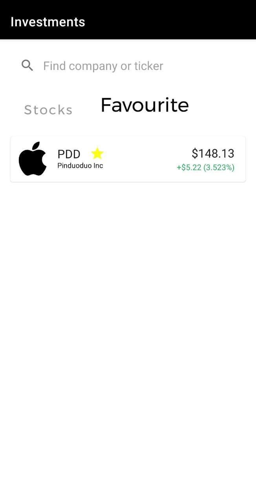

# Investments
Application provides access to **stock market data** via https://finnhub.io API.  

Starting page list shows **NASDAQ** stocks.  

At the top bar you can see **search** field for accessing stock with their names and tickers.  

You can save specific stocks in your **favourite** list marked with star.  

Each stock description shows current price and **chart** with last year price changes.  

